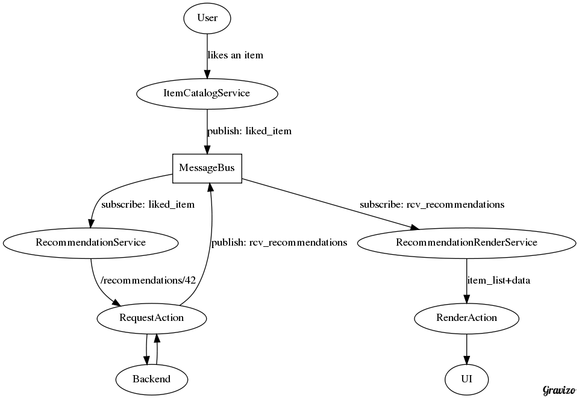

# MicroServices and Mobile

<!-- (APIdays Paris 2016) -->

## Oleksii Fedorov

Software Craftsperson

[@waterlink000](https://twitter.com/waterlink000)

<!-- -- data-background="url(./Pivotal_WhiteOnTeal.png) no-repeat center" data-background-size="cover"  -->

# Fast
### Iterations to Production
# For Everyone

(on mobile platforms)

## As Industry
#### We Need to
# Push Forward
#### and
# Reject Manual Review
## As Bad Practice

### The Problem:
# Mobile Waterfall

#### 2-4 Day
# Manual
#### Review Releases

#### Bug Fix?
# half a week

#### Testing Assumption
## Quickly
#### With Canary Release?
# forget it

#### You Should Be Getting Your Feedback
# in Minutes
## not days

#### Extensive End-To-End Testing Which Is
# Slow And Flaky

#### Extensive
# Manual
#### QA before release

#### Question:
## Aren't Beta Users Enough?

#### Counter-Question:
## Can We Deploy 10 Versions
# At The Same Time?

# Getting our Feedback Back

## Build the Web App

> The (Native) App is Dead; Long Live the (Web) App

_ https://thejournal.com/articles/2015/10/05/the-app-is-dead.aspx _

## Run the Web App in a Web View

## Dynamic Platform on Mobile

(e.g.: Javascript + React Native)

## Roll Your Own Solution

- Web App
- Web View + Web App
- Dynamic Platform
- ### Roll Your Own

## Domain-Specific Language

deployed to your servers

### Parsed & Interpreted

by your mobile application

### Example

When user likes an item  
We would like to show them recommendations

{
  "name": "RecommendationService",
  "subscribe": {
    "event": "liked_item",
    "actions": [
      {
        "request":
          "/recommendations/${event.item_id}",
        "publish": "rcv_recommendations"
      }
    ]
  }
}

{
  "name": "RecommendationService",
  "subscribe": {
    "event": "liked_item",
    "actions": [
      {
        "request":
          "/recommendations/${event.item_id}",
        "publish": "rcv_recommendations"
      }
    ]
  }
}

{
  "name": "RecommendationService",
  "subscribe": {
    "event": "liked_item",
    "actions": [
      {
        "request":
          "/recommendations/${event.item_id}",
        "publish": "rcv_recommendations"
      }
    ]
  }
}

{
  "name": "RecommendationService",
  "subscribe": {
    "event": "liked_item",
    "actions": [
      {
        "request":
          "/recommendations/${event.item_id}",
        "publish": "rcv_recommendations"
      }
    ]
  }
}

{
  "name": "RecommendationService",
  "subscribe": {
    "event": "liked_item",
    "actions": [
      {
        "request":
          "/recommendations/${event.item_id}",
        "publish": "rcv_recommendations"
      }
    ]
  }
}

{
  "name": "RecommendationService",
  "subscribe": {
    "event": "liked_item",
    "actions": [
      {
        "request":
          "/recommendations/${event.item_id}",
        "publish": "rcv_recommendations"
      }
    ]
  }
}

$ curl example.org/srv/recommendations
{
  "name": "RecommendationService",
  "subscribe": {
    "event": "liked_item",
    "actions": [
      {
        "request":
          "/recommendations/${event.item_id}",
        "publish": "rcv_recommendations"
      }
    ]
  }
}

{
  "name": "RecommendationRenderService",
  "subscribe": {
    "event": "rcv_recommendations",
    "actions": [
      {
        "render": { "view": "item_list",
            "data": "${event.response.items}" }
      }
    ]
  }
}

{
  "name": "RecommendationRenderService",
  "subscribe": {
    "event": "rcv_recommendations",
    "actions": [
      {
        "render": { "view": "item_list",
            "data": "${event.response.items}" }
      }
    ]
  }
}

{
  "name": "RecommendationRenderService",
  "subscribe": {
    "event": "rcv_recommendations",
    "actions": [
      {
        "render": { "view": "item_list",
            "data": "${event.response.items}" }
      }
    ]
  }
}

{
  "name": "RecommendationRenderService",
  "subscribe": {
    "event": "rcv_recommendations",
    "actions": [
      {
        "render": { "view": "item_list",
            "data": "${event.response.items}" }
      }
    ]
  }
}

{
  "name": "RecommendationRenderService",
  "subscribe": {
    "event": "rcv_recommendations",
    "actions": [
      {
        "render": { "view": "item_list",
            "data": "${event.response.items}" }
      }
    ]
  }
}

{
  "name": "RecommendationRenderService",
  "subscribe": {
    "event": "rcv_recommendations",
    "actions": [
      {
        "render": { "view": "item_list",
            "data": "${event.response.items}" }
      }
    ]
  }
}

$ curl example.org/srv/recommendations-render
{
  "name": "RecommendationRenderService",
  "subscribe": {
    "event": "rcv_recommendations",
    "actions": [
      {
        "render": { "view": "item_list",
            "data": "${event.response.items}" }
      }
    ]
  }
}

$ curl example.org/srv/
{
  "services": [
    "/srv/item-catalog",
    "/srv/recommendations",
    "/srv/recommendations-render"
  ]
}

## Meta Programming

### Trade-offs

- Might get rejected
- Complexity of DSL implementation
- 5-10% still deployed "old-school"

### DSL => Programming Language

## Pseudo-"MicroServices" Architecture

<!--  Backend [label="on start & on internet"];
    Backend -> Main;
    Main -> DSLInterpreter;
    DSLInterpreter -> ItemCatalogService [label="builds"];
    DSLInterpreter -> RecommendationService [label="builds"];
    DSLInterpreter -> RecommendationRenderService [label="builds"];
  }
'/> -->

<!--  ItemCatalogService [label="likes an item"];
    ItemCatalogService -> MessageBus [label="publish: liked_item"];
    MessageBus -> RecommendationService [label="subscribe: liked_item"];
    RecommendationService -> RequestAction [label="/recommendations/42"];
    RequestAction -> Backend;
    Backend -> RequestAction;
    RequestAction -> MessageBus [label="publish: rcv_recommendations"];
    MessageBus -> RecommendationRenderService [label="subscribe: rcv_recommendations"];
    RecommendationRenderService -> RenderAction [label="item_list+data"]
    RenderAction -> UI;
  }
'/> -->

## Bottom Line

## As Industry
#### We Need to
# Push Forward
#### and
# Reject Manual Review
## As Bad Practice

## Q&A

## Thanks

Twitter: [twitter.com/waterlink000](https://twitter.com/waterlink000)

Github: [github.com/waterlink](https://github.com/waterlink)

Blog: [tddfellow.com](http://tddfellow.com)
