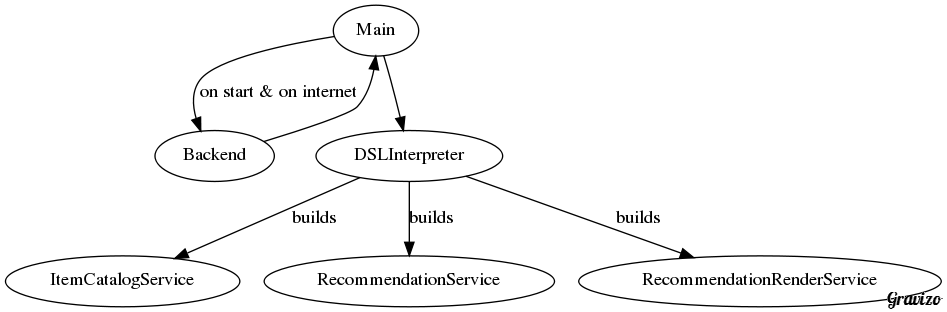

# MicroServices and Mobile

<!-- (APIdays Paris 2016) -->

## Oleksii Fedorov

Software Craftsperson

[@waterlink000](https://twitter.com/waterlink000)

<!-- -- data-background="url(./Pivotal_WhiteOnTeal.png) no-repeat center" data-background-size="cover"  -->

# Mobile Waterfall

#### 2-4 Day
# Manual
#### Review Releases

#### Bug Fix?
# half a week

#### Testing Assumption
## Quickly
#### With Canary Release?
# forget it

#### You Should Be Getting Your Feedback
# in Minutes
## not days

#### Extensive End-To-End Testing Which Is
# Slow And Flaky

#### Extensive
# Manual
#### QA before release

## Getting our Feedback Back

### Domain-Specific Language

deployed to your servers

### Parsed & Interpreted

by your mobile application

### Example

When user likes an item  
We would like to show them recommendations

{
  "name": "RecommendationService",
  "subscribe": {
    "event": "liked_item",
    "actions": [
      {
        "request":
          "/recommendations/${event.item_id}",
        "publish": "rcv_recommendations"
      }
    ]
  }
}

{
  "name": "RecommendationRenderService",
  "subscribe": {
    "event": "rcv_recommendations",
    "actions": [
      {
        "render": { view": "item_list",
            "data": "${event.response.items}" }
      }
    ]
  }
}

### Trade-offs

- Might get rejected
- Complexity of DSL implementation
- 5-10% still deployed "old-school"

### DSL => Programming Language

for example: Javascript + React Native

## Pseudo-"MicroServices" Architecture

<!--  Backend [label="on start & on internet"];
    Backend -> Main;
    Main -> DSLInterpreter;
    DSLInterpreter -> ItemCatalogService [label="builds"];
    DSLInterpreter -> RecommendationService [label="builds"];
    DSLInterpreter -> RecommendationRenderService [label="builds"];
  }
'/> -->

<!--  ItemCatalogService [label="likes an item"];
    ItemCatalogService -> MessageBus [label="publish: liked_item"];
    MessageBus -> RecommendationService [label="subscribe: liked_item"];
    RecommendationService -> RequestAction [label="/recommendations/42"];
    RequestAction -> Backend;
    Backend -> RequestAction;
    RequestAction -> MessageBus [label="publish: rcv_recommendations"];
    MessageBus -> RecommendationRenderService [label="subscribe: rcv_recommendations"];
    RecommendationRenderService -> RenderAction [label="item_list+data"]
    RenderAction -> UI;
  }
'/> -->

## Bottom Line

## As Industry
#### We Need to
# Push Forward
#### and
# Reject Manual Review
## As Bad Practice

## Recap and Q&A

- Mobile Waterfall
- Domain-Specific Language & Example
- Trade-offs
- "MicroServices" architecture in that DSL

## Thanks

Twitter: [twitter.com/waterlink000](https://twitter.com/waterlink000)

Github: [github.com/waterlink](https://github.com/waterlink)

Blog: [tddfellow.com](http://tddfellow.com)
